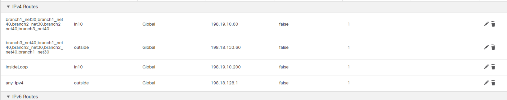
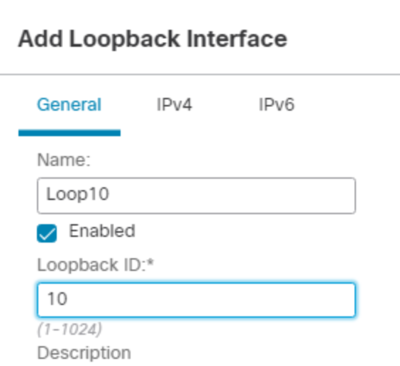
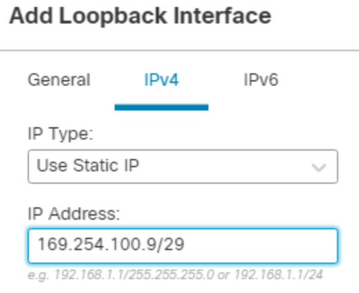
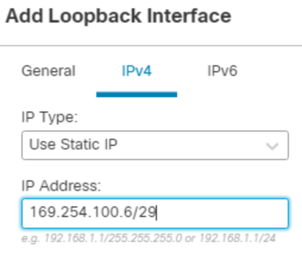
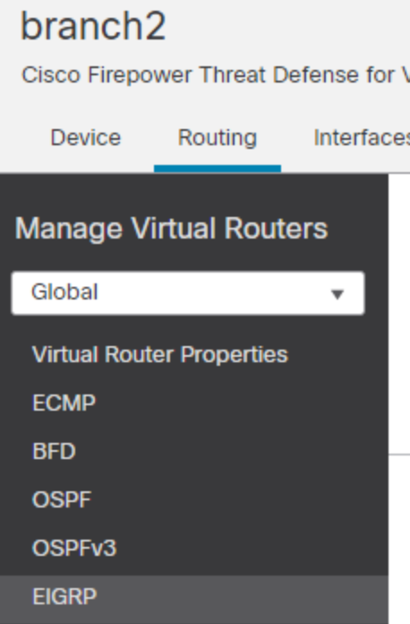
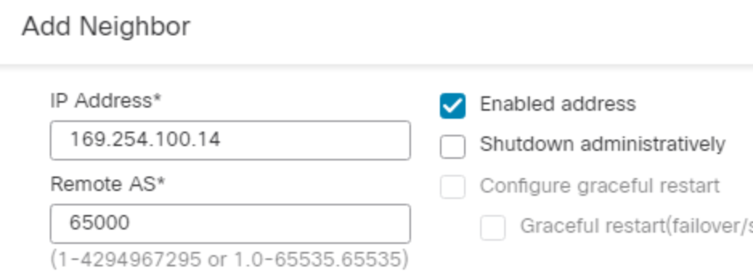
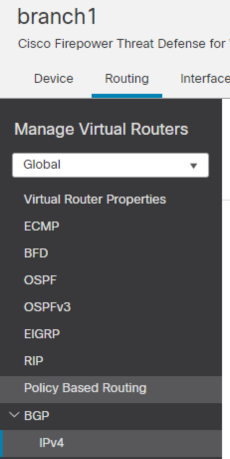
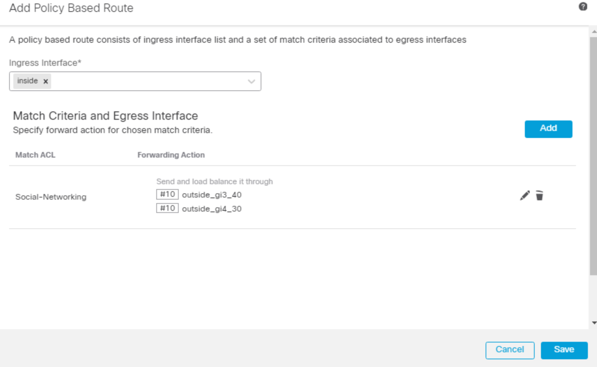

# (Firepower SD-WAN) Tectorial from Zero to Hero

| **Note** | This is not a Firepower training, it expects people to know how to configure the basics including, but not limited to: interfaces, static routing, dynamic routing, rules and NAT |
|--|--|
## Agenda
- Lab Topologies
- Overall configuration
- Interface configuration
- Routing and ECMP configuration
- Direct Internet Access (DIA) configuration
- SDWAN configuration
- SDWAN and WAN status/summary
## Lab Topologies


## Overall configuration

The following screenshots will guide you how to configure the interfaces, static routings and ECMP alongside with the topology drawings. 

Firewalls that will be using during this lab


### HUB - NGFW1
1. Interfaces


2. Static Route - HUB has a default route to internet and static routes to PE router to reach branches external IPs


3. ECMP to reach spokes, since HUB has 2 links


### Branch1

1. Interfaces


2. Static route (vrf ext)


3. ECMP (vrf ext)


### Branch2

1. Interfaces


2. Static route


3. ECMP


### Branch3

1. Interfaces


2. Static route


3. ECMP - N/A because Branch3 has only 1 WAN interface

## Interface configuration

### Hub (NGFW1) - Configuring two DVTI interfaces to use with two WAN links

| **Note:** | HUB will contain two loopback interfaces, one per topology. SDWAN topology is, in simple words, created per WAN links at the HUB. It can also be created for other reasons |
| --------- | -------------------------------------------------------------------------------------------------------------------------------------------------------------------------- |

Hub will have two loopbacks because it has 2 links. They will be addressed as CIDR /29 to accommodate 1 hub and 3 spokes inside the same network. Their addresses will be: 
- Loop10: 169.254.100.0/29 where the HUB is the first valid IP inside the block
- Loop11: 169.254.100.8/29 where the HUB is the first valid IP inside the block

#### Connecting to the lab
1. Open **jumpbox** by clicking on WEB_RDP link inside the section **How to Connect to the Lab Environment**


2. You will be presented with the **Quick Launch** page as soon as you are logged in. In case you are not presented with this page or you accidentally close during your lab, go to **Desktop** and double-click on this icon  


3. ​You will be presented with the following page  that contains most of the access you will need to complete this lab


#### VPN1 - Interface outside - using Loop10 169.254.100.0/29.

1. Go to **Devices > Device Management**. Find **NGFW1** and click on the pencil to **edit** it  
2. Inside **Interfaces** tab, click on **Add Interfaces > Loopback Interface**
<br>

3. Fill out name and Loopback ID as per image under **General** tab. 
<br>

4. Go to **IPv4** tab and fill out IP Address. Click **Ok** to finish.
<br>

5. Create a **Dynamic** Virtual Tunnel Interface (DVTI) using Loop10 IP address we just created. 
	- Create a separate Security Zone for Static/Dynamic VTIs. We will be using Zone **VTI** here. If you don't have it, you need to create under this page
	- Tunnel source was left unchecked because it will be chosen when creating the SDWAN topology, so no need to do this here
	- Use meaningful names so you know which physical and which loopback you are using on your DVTIs or SVTIs
6. Go to **Add Interfaces** again and select **Virtual Tunnel Interface**
<br>

7. There are some fields to fill out:
	1. Tunnel Type: **Dynamic**. This is the default when configuring the HUB. Branches will be of Static type
	2. Name: **DVTI_outside_Loop10**
	3. Security Zone: **VTI**.
	4. Template ID: select a number to represent this DVTI. We will use **10** to match our loopback number
	5. Tunnel Source: leave it blank, we will select the source while creating the topology
	6. IP address: we will use **IP unnumbered** with the IP of the Loopback **Loop10** we created before


| Note: | If you do not have VTI Security Zone, you can create it from here                        |
| ----- | ---------------------------------------------------------------------------------------- |
|       | <br><br><br><br><br> |

<br>


8. Click **Ok** to create the DVTI interface

#### VPN2 - Interface in10 - using Loop11 169.254.100.8/29.

1. Go to **Devices > Device Management**. Find **NGFW1** and click on the pencil to **edit** it  
2. Inside **Interfaces** tab, click on **Add Interfaces > Loopback Interface**
<br>

3. Fill out name and Loopback ID as per image under **General** tab. 
<br>

4. Go to **IPv4** tab and fill out IP Address. Click **Ok** to finish.
<br>

5. Create a **Dynamic** Virtual Tunnel Interface (DVTI) using Loop11 IP address we just created. 
	- Since we have already created the **VTI** Security Zone before, then we will be using it.
	- Tunnel source was left unchecked because it will be chosen when creating the SDWAN topology, so no need to do this here
	- Use meaningful names so you know which physical and which loopback you are using on your DVTIs or SVTIs
6. Go to **Add Interfaces** again and select **Virtual Tunnel Interface**
<br>

7. There are some fields to fill out:
	1. Tunnel Type: **Dynamic**. This is the default when configuring the HUB. Branches will be of Static type
	2. Name: **DVTI_in10_Loop11**
	3. Security Zone: **VTI**.
	4. Template ID: select a number to represent this DVTI. We will use **11** to match our loopback number
	5. Tunnel Source: leave it blank, we will select the source while creating the topology
	6. IP address: we will use **IP unnumbered** with the IP of the Loopback **Loop11** we created before


8. Click **Ok** to create the DVTI interface
9. Click **Save**
<br>

Interfaces overview:


### Branch3 - Configuring two SVTI interfaces to connect with the two HUB links

1. Go to **Devices > Device Management**. Find **Branch3** and click on the pencil to **edit** it  
2. Inside **Interfaces** tab, click on **Add Interfaces** **> Loopback Interface**
<br>

3. Fill out name and Loopback ID as per image under **General** tab. 
<br>

4. Go to **IPv4** tab and fill out IP Address. Click **Ok** to finish.
<br>

5. Create the second Loopback interface, use the same steps as before
<br>


6. Create a **Static** Virtual Tunnel Interface (SVTI) using Loop10 IP address we just created. 
	- Since we have already created the **VTI** Security Zone before, then we don't need to create again.
	- Use meaningful names so you know which physical and which loopback you are using on your DVTIs or SVTIs
7. Go to **Add Interfaces** again and select **Virtual Tunnel Interface**
<br>

8. There are some fields to fill out:
	1. Tunnel Type: **Static**. This is the default when configuring the Branches.
	2. Name: **SVTI_outside20_Loop10**
	3. Security Zone: **VTI**
	4. Tunnel ID: select a number to represent this SVTI. We will use **10** to match our loopback number
	5. Tunnel Source: select the outside interface as it will be the only one reach out to HUB. Branch3 has only one WAN interface, which is **outside_20**
	6. IP address: we will use **IP unnumbered** with the IP of the Loopback **Loop10** we created before


9. Go to **Add Interfaces** again and select **Virtual Tunnel Interface**
<br>

10. There are some fields to fill out:
	1. Tunnel Type: **Static**. This is the default when configuring the Branches.
	2. Name: **SVTI_outside20_Loop11**
	3. Security Zone: **VTI**
	4. Tunnel ID: select a number to represent this SVTI. We will use **11** to match our loopback number
	5. Tunnel Source: select the outside interface as it will be the only one reach out to HUB. Branch3 has only one WAN interface, which is **outside_20**
	6. IP address: we will use **IP unnumbered** with the IP of the Loopback **Loop11** we created before


11. Click **Ok** and then Save the configuration
<br>

Interfaces overview:


### Branch2 - Configuring two SVTI interfaces to connect with the two HUB links

1. Go to **Devices > Device Management**. Find **Branch2** and click on the pencil to **edit** it  
2. Inside **Interfaces** tab, click on **Add Interfaces** **> Loopback Interface**
<br>

3. Fill out name and Loopback ID as per image under **General** tab. 
<br>

4. Go to **IPv4** tab and fill out IP Address. Click **Ok** to finish.
<br>

5. Create the second Loopback interface, use the same steps as before
<br>


6. Create a **Static** Virtual Tunnel Interface (SVTI) using Loop10 IP address we just created. 
	- Since we have already created the **VTI** Security Zone before, then we will be using it.
	- Use meaningful names so you know which physical and which loopback you are using on your DVTIs or SVTIs
7. Go to **Add Interfaces** again and select **Virtual Tunnel Interface**
<br>

8. There are some fields to fill out:
	1. Tunnel Type: **Static**. This is the default when configuring the Branches.
	2. Name: **SVTI_outside_gi3_40_Loop10**
	3. Security Zone: **VTI**
	4. Tunnel ID: select a number to represent this SVTI. We will use **10** to match our loopback number
	5. Tunnel Source: select Gi0/3 (**outside_gi3_40**) as it will be the first interface we will be using to reach out to HUB. Branch2 has two WAN interfaces, we will create one SVTI per WAN interface in this lab.
	6. IP address: we will use **IP unnumbered** with the IP of the Loopback **Loop10** we created before


9. Go to **Add Interfaces** again and select **Virtual Tunnel Interface**
<br>

10. There are some fields to fill out:
	1. Tunnel Type: **Static**. This is the default when configuring the Branches.
	2. Name: **SVTI_outside_gi4_50_Loop11**
	3. Security Zone: **VTI**
	4. Tunnel ID: select a number to represent this SVTI. We will use **11** to match our loopback number
	5. Tunnel Source: select Gi0/4 (**outside_gi4_50**) as it will be the second interface we will be using to reach out to HUB. Branch2 has two WAN interfaces, we will create one SVTI per WAN interface in this lab.
	6. IP address: we will use **IP unnumbered** with the IP of the Loopback **Loop11** we created before


11. Click **Ok** and then Save the configuration
<br>

Interfaces overview:


### Branch1 - Configuring two SVTI interfaces to connect with the two HUB links

1. Go to **Devices > Device Management**. Find **Branch1** and click on the pencil to **edit** it  
2. Inside **Interfaces** tab, click on **Add Interfaces** **> Loopback Interface**
<br>

3. Fill out name and Loopback ID as per image under **General** tab. 
<br>

4. Go to **IPv4** tab and fill out IP Address. Click **Ok** to finish.
<br>

5. Create the second Loopback interface, use the same steps as before
<br>


6. Create a **Static** Virtual Tunnel Interface (SVTI) using Loop10 IP address we just created. 
	- Since we have already created the **VTI** Security Zone before, then we will be using it.
	- Use meaningful names so you know which physical and which loopback you are using on your DVTIs or SVTIs
7. Go to **Add Interfaces** again and select **Virtual Tunnel Interface**
<br>

8. There are some fields to fill out:
	1. Tunnel Type: **Static**. This is the default when configuring the Branches.
	2. Name: **SVTI_outside_gi3_40_Loop10**
	3. Security Zone: **VTI**
	4. Tunnel ID: select a number to represent this SVTI. We will use **10** to match our loopback number
	5. Tunnel Source: select Gi0/3 (**outside_gi3_40**) as it will be the first interface we will be using to reach out to HUB. Branch1 has two WAN interfaces, we will create one SVTI per WAN interface in this lab.
	6. IP address: we will use **IP unnumbered** with the IP of the Loopback **Loop10** we created before


9. Go to **Add Interfaces** again and select **Virtual Tunnel Interface**
<br>

10. There are some fields to fill out:
	1. Tunnel Type: **Static**. This is the default when configuring the Branches.
	2. Name: **SVTI_outside_gi4_30_Loop11**
	3. Security Zone: **VTI**
	4. Tunnel ID: select a number to represent this SVTI. We will use **11** to match our loopback number
	5. Tunnel Source: select Gi0/4 (**outside_gi4_30**) as it will be the second interface we will be using to reach out to HUB. Branch1 has two WAN interfaces, we will create one SVTI per WAN interface in this lab.
	6. IP address: we will use **IP unnumbered** with the IP of the Loopback **Loop11** we created before


11. Click **Ok**
12. Click **Ok** and then Save the configuration
<br>

Interfaces overview:


## Routing and ECMP configuration

Based on the following topology, configure the routing protocols on the HUB and Branches.


### HUB and Branch3 - OSPF

This will be a basic OSPF configuration where HUB will announce the network **Corporate4** (198.19.40.0/24) and Branch3 will announce **198.60.30.0/24**

#### HUB (NGFW1) configuration

1. Go to **Devices > Device Management**. Find **NGFW1** and click on the pencil to **edit** it  
2. Click on **Routing** tab and then click on **OSPF** option
<br>

3. We need to enable OSPF process, click on **Process 1**


4. Under **Area** tab, click **Add** to add a new Area
<br>

5. When configuring the area, we will choose **Area ID** 100
<br>

6. Now we will select the networks that are part of OSPF. Since we do not have the objects yet, we will create them as follows: **Corporate4** (198.19.40.0/24) and **net_Loop10** (169.254.100.0/29) and **net_Loop11** (169.254.100.8/29). Click on the + (plus) sign to create the new objects.
	- Click Save and then click on the + (plus) sign again to create other objects


7. After creating the objects, they can be searched in the **Available Network** field. Search for **Corporate4**,  **net_Loop10**, and **net_Loop11**. Then click **Add** to add them to **Selected Network**. Click **Ok** to finish.


8. Click Ok and then Save
<br>

#### Branch3 configuration

9. Let's jump to **Branch3** and do the same. 
10. Go to **Devices > Device Management**. Find **Branch3** and click on the pencil to **edit** it  
11. Click on **Routing** tab and then click on **OSPF** option
<br>

12. We need to enable OSPF process, click on **Process 1**


13. Under **Area** tab, click **Add** to add a new Area
<br>

14. When configuring the area, we will choose **Area ID** 100
<br>

15. Now we will select the networks that are part of OSPF. Since we do not have the object for Branch3 network yet, we will create it as follows: **net_Branch3** (198.60.30.0/24). Click on the + (plus) sign to create a new object.
	- Click Save to create the object


16. After creating the object, they can be searched in the **Available Network** field. Search for **net_Branch3**,  **net_Loop10**, and **net_Loop11**. Then click **Add** to add them to **Selected Network**. Click **Ok** to finish.


17. Click Ok
18. Still under **Routing** tab, click on **ECMP** menu
<br>

19. Click **Add** to add a new ECMP zone.
20. Name the zone **ECMP-VTI**, select both SVTI and add them.


21. Click Ok and then Save
<br>

### HUB and Branch2 - EIGRP

#### HUB (NGFW1) configuration

1. Go to **Devices > Device Management**. Find **NGFW1** and click on the pencil to **edit** it  
2. Click on **Routing** tab and then click on **EIGRP** option
<br>

3. We need to enable EIGRP process, click on **Enable** and pick an AS Number. We will use AS Number **10**


4. Now we will select the networks that are part of EIGRP. Since we do not have the object yet, we will create them as follows: **Corporate3** (198.19.30.0/24). For Loop10 and Loop11 we have already created the objects in the previous task, when we configured OSFP. Click on the + (plus) sign to create the new objects.
	- Click Save


5. After creating the objects, they can be searched in the **Available Network** field. Search for **Corporate3**,  **net_Loop10**, and **net_Loop11**. Then click **Add** to add them to **Selected Network**. Click **Ok** to finish.


6. Click Ok and then Save
<br>

#### Branch2 configuration

7. Let's jump to **Branch2** and do the same. 
8. Go to **Devices > Device Management**. Find **Branch2** and click on the pencil to **edit** it  
9. Click on **Routing** tab and then click on **EIGRP** option
<br>

10. We need to enable EIGRP process, click on **Enable** and pick an AS Number. We will use AS Number **10**


11. Now we will select the networks that are part of EIGRP. Since we do not have the Branch2 object yet, we will create it as follows: **net_Branch2** (198.60.20/24). The objects for Loop10 and Loop11 have been already created in the previous task, when we configured OSFP. Click on the + (plus) sign to create the new object.
	- Click Save


12. After creating the object, they can be searched in the **Available Network** field. Search for **net_Branch2**,  **net_Loop10**, and **net_Loop11**. Then click **Add** to add them to **Selected Network**. Click **Ok** to finish.
<br>

13. Click Ok
14. Still under **Routing** tab, click on **ECMP** menu
<br>

15. Click **Add** to add a new ECMP zone.
16. Name the zone **ECMP-VTI**, select both SVTI and add them.


17. Click Ok and then Save
<br>

### HUB and Branch1 - BGP

Branch1 will be able to receive a default route from BGP because it has been configured with a **front-door VRF**. You can check this configuration under **Routing** tab


The VRF is called **ext** and it has the two WAN links. When we select the VRF, we can see the two default routes going to the local ISP


So, in order to avoid routing problem where Firepower has default routes to ISPs and also receives default routes via BGP, we need to create a front-door VRF. Gladly, Firepower doesn't require you to know how to leak routes, it does everything for you.

#### HUB (NGFW1) configuration

1. Go to **Devices > Device Management**. Find **NGFW1** and click on the pencil to **edit** it
2. Click on **Routing** tab, click on **BGP** under General Settings at the bottom of the right hand side.
<br>

4. Click on **Enable BGP** checkbox and type the AS Number. Private AS starts at 65000, so this will be our choice


4. Click on **BGP > IPv4** on the left hand side
<br>

5. Click on **Enable IPv4** option
<br>

6. Under **General** tab, edit the options below
	1. Forward Packets Over Multiple Paths
		- Number of Paths: 2
		- iBGP number of paths: 2
<br>

7. Under **Neighbor** tab, click **Add** to add a new neighbor


8. We will add two neighbors, one per Branch1 WAN interface. Since each WAN will have a SVTI, we can become neighbor in each interface. We will fill out the following fields
	1. IP Address: 169.254.100.6 (Branch1 SVTI over gi3)
	2. Remote AS: 65000 (same for both)
	3. Check the option **Enable address**
	4. Under **Routes** tab, check the option **Generate default routes**
	5. Under **Advanced** tab, check the option **Use itself as next hop for this neighbor**
	6. Click **Ok**


9. Now we will do the same steps again for the other SVTI to Branch1.
	1. IP Address: 169.254.100.14 (Branch1 SVTI over gi4)
	2. Remote AS: 65000 (same for both)
	3. Check the option **Enable address**
	4. Under **Routes** tab, check the option **Generate default routes**
	5. Under **Advanced** tab, check the option **Use itself as next hop for this neighbor**
	6. Click **Ok**
<br>


10. Click Ok and then Save
<br>

#### Branch1 configuration

1. Go to **Devices > Device Management**. Find **Branch1** and click on the pencil to **edit** it
2. Click on **Routing** tab, click on **BGP** under General Settings at the bottom of the right hand side. Make sure you are NOT in the VRF but in the **Global** table. You can easily spot this looking at under **Manage Virtual Routers** where it says "Global"
<br>

4. Click on **Enable BGP** checkbox and type the AS Number. Private AS starts at 65000, so this will be our choice


4. Click on **BGP > IPv4** on the left hand side
<br>

5. Click on **Enable IPv4** option
<br>

6. Under **General** tab, edit the options below
	1. Forward Packets Over Multiple Paths
		- Number of Paths: 2
		- iBGP number of paths: 2
<br>

7. Under **Neighbor** tab, click **Add** to add a new neighbor


8. We will add two neighbors, one per HUB WAN interface. Since each Branch1 WAN has a SVTI, we can become neighbor in each interface. We will fill out the following fields
	1. IP Address: 169.254.100.1 (HUB DVTI over outside interface)
	2. Remote AS: 65000 (same for both)
	3. Check the option **Enable address**
	4. Click **Ok**


9. Now we will do the same steps again for the other SVTI to HUB.
	1. IP Address: 169.254.100.9 (HUB DVTI over in10)
	2. Remote AS: 65000 (same for both)
	3. Check the option **Enable address**
	4. Click **Ok**
<br>

10. Under **Networks** tab, click the + (plus) sign to add a network to be advertised
11. Click on the drop down menu and select the object **Branch-LAN**
<br>

12. Click Ok
13. Still under **Routing** tab, click on **ECMP** menu
<br>

14. Click **Add** to add a new ECMP zone.
15. Name the zone **ECMP-VTI**, select both SVTI and add them.


16. Click Ok and then Save
<br>

## Direct Internet Access (DIA) configuration

- DIA is a feature that gives the branch local internet access without going to HUB for internet or SaaS services. 
- Branch2 and Branch3 only receive specific routes from HUB via their respective dynamic routing protocols. With that, the default route prevails and they already send internet traffic to their local ISP.
- Branch1 by the other hand, it receives and default route via BGP, meaning, it will send everything to HUB. In this case we can leverage DIA to send some applications to exit via local ISPs, balanced by their dual ISP approach.

#### Branch1 - Default routes to WAN providers - VRF ext

1. Under **Routing** tab, click on **Manage Virtual Routers**


2. Select **ext** using the drop down menu.
<br>

3. VRF is called **ext**. Click on **Static route** to see Branch1 two default route to local ISPs. 


4. Click on **ECMP** to see the load-balancing on these two links


#### Branch1 - Static route - Global table

As we mentioned, Branch1 will receive a default route via BGP when tunnel is up. This default route will be installed in the global routing table which will not conflict with ISP routes installed at VRF ext

1. Click on **Manage Virtual Routes** again and now select Global
<br>

2. Now click on **Static Route**. Notice that there aren't any routes configured since it will receive via BGP


#### Enabling Path Monitoring

Path monitoring, when configured on interfaces, derive metrics such as round trip time (RTT), jitter, mean opinion score (MOS), and packet loss per interface. These metrics are used to determine the best path for routing PBR traffic.

ICMP-based Path Monitoring
- The metrics on the interfaces are collected dynamically using ICMP probe messages to the interface's default gateway or a specified remote peer.
HTTP-based Path Monitoring
- Path monitoring computes flexible metrics for multiple remote peers per interface. To monitor and determine best path for multiple applications through a policy on a branch firewall, HTTP is preferred over ICMP for the following reasons:
	- HTTP-ping can derive the performance metrics of the path up to the application layer of the server, where the application is hosted.
	- The need to change the firewall configuration whenever the application server IP address is changed is removed as the application domain is tracked instead of the IP address.
	

1. Edit Branch1, under **Interfaces** tab, we will select both WAN interfaces to enable Path Monitoring.
2. Select Gi0/3 and click on the pencil to edit it
3. Click on **Path Monitoring** to enable the metrics over ICMP and HTTP. We will enable both in this lab
4. Click **Ok**
<br>

5. Select Gi0/4 and click on the pencil to edit it
6. Click on **Path Monitoring** to enable the metrics over ICMP and HTTP. We will enable both in this lab


#### Enabling PBR

PBR and Path Monitoring
- Typically, in PBR, traffic is forwarded through egress interfaces based on the priority value (interface cost) configured on them. From management center version 7.2, PBR uses IP-based path monitoring to collect the performance metrics (RTT, jitter, packet-lost, and MOS) of the egress interfaces. PBR uses the metrics to determine the best path (egress interface) for forwarding the traffic. Path monitoring periodically notifies PBR about the monitored interface whose metric got changed. PBR retrieves the latest metric values for the monitored interfaces from the path monitoring database and updates the data path.

PBR and HTTP-based Path Monitoring
- From management center version 7.4, PBR can be configured to use HTTP-based path monitoring to collect the performance metrics of the application domains and not just one destination IP address. Path monitoring does not commence monitoring immediately after HTTP-based application monitoring is configured. It starts monitoring only when a DNS entry is snooped for a domain. With the information on the resolved IP for the domain, it sends and receives the HTTP request and response respectively. When DNS resolves multiple IP addresses for a single domain, the first resolved IP address will be used for probing and monitoring the application. It continues to monitor till the IP address changes or the HTTP-based path monitoring is disabled.

1. Now, under **Routing** tab, inside Global routing table, select **Policy Based Routing**
<br>

2. Click **Configure Interface Priority** to specify if there is any preferred interface over the other. Set both WAN interfaces with priority **10** so they can load-balance between them.
3. Click Save.
4. Create a new PBR policy by clicking on Add button
<br>

5. Select which interface the users will be coming from. In our case, interface inside


6. Click Add again
7. In this page, we will configure the following
	1. **Match ACL**: this is the applications we want to enable DIA. Create an ACL called **Social-Networking** and add social network applications such as LinkedIn, Facebook and Instagram
	2. **Send to**: which interface you want to send this traffic that matches the ACL. This can be either an IP or Egress interface. Select **Egress Interfaces** 
	3. **Interface Ordering**: how we are going to choose which interface to send the traffic to. Select **Interface Priority**. Just for documentation purpose, here are the options:
		- By Interface Priority—The traffic is forwarded based on the priority of the interfaces. Traffic is routed to the interface with the least priority value first. When the interface is not available, the traffic is then forwarded to the interface with the next lowest priority value
		- By Order—The traffic is forwarded based on the sequence of the interfaces specified here
		- By Minimal Jitter—The traffic is forwarded to the interface that has the lowest jitter value
		- By Maximum Mean Opinion Score—The traffic is forwarded to the interface that has the maximum mean opinion score (MOS)
		- By Minimal Round Trip Time—The traffic is forwarded to the interface that has the minimal round trip time (RTT)
		- By Minimal Packet Loss—The traffic is forwarded to the interface that has the minimal packet loss. You need to enable Path Monitoring on the interfaces for PBR to obtain the packet loss values.
	
8. To create an ACL, click on the + (plus) sign next to Match ACL field.
9. Give it a name and click Add


10. Keep the defaults. Under **Application** tab, select the applications we mentioned above. 
11. Click **Add** then click **Save**


12. Click **Save** again


13. Click **Save** to finish the process


14. Click **Save** to save the policy
<br>

| **Note:** | We can monitor the behavior by debugging the decisions using the CLI command ```debug policy-route``` |
| --------- | ----------------------------------------------------------------------------------------------------- |

## SDWAN configuration

With all the previous steps having been completed, we are ready to configure SDWAN topologies. 

1. Go to **Devices > Site to Site** menu
<br>

2. Click on **Site to Site VPN** button
<br>

### SDWAN Topology 1
1. Type a **topology name**, select **Route Based VTI** and then select **Hub and Spoke** network topology
2. The topology name is important to remind us which Topology we are working with, in this case, the HUB DVTI will be using **outside** interface and **Loop10**


3. Under **Endpoints** tab, click the + (plus) sign to add **Hub nodes**
4. Now select the following:
	1. Device: **NGFW1**
	2. Dynamic Virtual Tunnel Interface (DVTI): **DVTI_outside_Loop10**
	3. Tunnel Source: **Giga0/0 (outside)**
	4. IP address: 198.18.133.81
	5. Click **Advanced Settings**
		- Check the option **Send Virtual Tunnel Interface IP to the peers**
	6. Click **Ok**
<br>

5. Click on the + (plus) sign to add **Spoke Nodes**
6. Select the following:
	1. Device: **branch1**
	2. Static Virtual Tunnel Interface (SVTI): **SVTI_outside_gi3_40_Loop10**
	3. Click **Ok**
<br>

7. Click on the + (plus) sign again to add **Spoke Nodes**
8. Select the following:
	1. Device: **branch2**
	2. Static Virtual Tunnel Interface (SVTI): **SVTI_outside_gi3_40_Loop10**
	3. Click **Ok**
<br>

9. Click on the + (plus) sign again to add **Spoke Nodes**
10. Select the following:
	1. Device: **branch3**
	2. Static Virtual Tunnel Interface (SVTI): **SVTI_outside20_Loop10**
	3. Click **Ok**
<br>

11. Under **IKE** tab, change **Authentication Type** to **Pre-shared Manual Key**
	- Type and confirm the key: C1sco12345
12. Click **Save**

SDWAN1 - Overall configuration


#### SDWAN Topology 2
1. Type a **topology name**, select **Route Based VTI** and then select **Hub and Spoke** network topology
2. The topology name is important to remind us which Topology we are working with, in this case, the HUB DVTI will be using **in10** interface and **Loop11**


3. Under **Endpoints** tab, click the + (plus) sign to add **Hub nodes**
4. Now select the following:
	1. Device: **NGFW1**
	2. Dynamic Virtual Tunnel Interface (DVTI): **DVTI_in10_Loop11**
	3. Tunnel Source: **Giga0/1 (in10)**
	4. IP address: 198.19.10.1
	5. Click **Advanced Settings**
		- Check the option **Send Virtual Tunnel Interface IP to the peers**
	6. Click **Ok**
<br>

5. Click on the + (plus) sign to add **Spoke Nodes**
6. Select the following:
	1. Device: **branch1**
	2. Static Virtual Tunnel Interface (SVTI): **SVTI_outside_gi4_30_Loop11**
	3. Click **Ok**
<br>

7. Click on the + (plus) sign again to add **Spoke Nodes**
8. Select the following:
	1. Device: **branch2**
	2. Static Virtual Tunnel Interface (SVTI): **SVTI_outside_gi4_50_Loop11**
	3. Click **Ok**
<br>

9. Click on the + (plus) sign again to add **Spoke Nodes**
10. Select the following:
	1. Device: **branch3**
	2. Static Virtual Tunnel Interface (SVTI): **SVTI_outside20_Loop11**
	3. Click **Ok**
<br>

11. Under **IKE** tab, change **Authentication Type** to **Pre-shared Manual Key**
	- Type and confirm the key: C1sco12345
12. Click **Save**

SDWAN2 - Overal configuration


## Deploy and Validation

### Deploy
1. Deploy the configuration to all devices
2. Click **Deploy** at the top right hand side


3. Click **Ignore Warnings** and click **Deploy all**
<br>

4. Wait to see whether the deploy was completed


### Validation

Tests are based on this topology


1. Open Putty and SSH to the following IPs
	1. HUB (NGFW1): 198.19.10.81
		- username: admin / password: C1sco12345
	2. Branch1: 198.18.133.42
		- username: admin / password: C1sco12345
	3. Branch2: 198.19.10.82
		- username: admin / password: C1sco12345
	4. Branch3: 198.19.10.83
		- username: admin / password: C1sco12345

#### Validating Branch3 connections

1. Inside HUB (NGFW1) and Branch3, type the command ``show route ospf`` to see which routes have been advertised
2. HUB (NGFW1)


3. Branch3


4. Open **Quick Launch** and click **CSR-64** (topology reference as CSR4) 


5. Type the command ```debug ip icmp``` to see the ICMP messages
6. Now type the command ```ping vrf branch3 198.19.40.64``` to test connectivity from Branch3 to Corporate4. Follow output from ping from 198.60.30.64 to 198.19.40.64

#### Validating Branch2 connections

Inside HUB (NGFW1) and Branch2, type the command ``show route ospf`` to see which routes have been advertised
2. HUB (NGFW1)


3. Branch2


4. Open **Quick Launch** and click **CSR-61** (topology references as CSR1)


5. Type the command **debug ip icmp** to see the ICMP messages
6. Now type the command **ping vrf branch2 198.19.30.63** to test connectivity from Branch2 to Corporate3. Follow the output of ping from 198.60.20.61 to 198.19.30.63


#### Validating Branch1 connections

Inside HUB (NGFW1) and Branch1, type the command ``show route bgp`` to see which routes have been advertised
2. HUB (NGFW1)


3. Branch1


4. Open **Quick Launch** and click **Kali Inside Linux** (topology references as Kali)


5. Now type the command **ping 198.19.20.62** to test connectivity from Branch1 to Corporate2. Follow the output of ping from 198.19.11.200 to 198.19.20.62


6. SSH into branch1 (198.18.133.42 / admin / C1sco12345), type the command **debug policy-route** to see the PBR being hit and steering the traffic to the local exit ISP.  
7. Testing Path Monitoring, DIA and PBR by pinging one or all of the following domains from **Branch Office Linux**.  
```shell
ping facebook.com
ping instagram.com
ping linkedin.com
```

8. Output from ​Branch Office Linux after a ping
```
[root@branch ~]# ping facebook.com
PING facebook.com (31.13.80.36) 56(84) bytes of data.
64 bytes from edge-star-mini-shv-01-yyz1.facebook.com (31.13.80.36): icmp_seq=1 
```

9. Output from ​branch1 debug command


## SDWAN and WAN status/summary

1. Go to **Devices > Site to Site VPN** and expand the two SDWANs topology we created earlier. They should be green with 3 tunnels UP
2. SDWAN1 using HUB DVTI Loop10


3. SDWAN2 using HUB DVTI Loop11


4. Go to **Overview > SD-WAN Summary**. Overview tab will show some stats about SDWAN health


5. Also at the SD-WAN Summary, click on **Application Monitoring** tab. It will show you the stats of the interfaces we enabled **Path Monitoring** which was only on branch1


6. Go to **Overview > Site to Site VPN**


